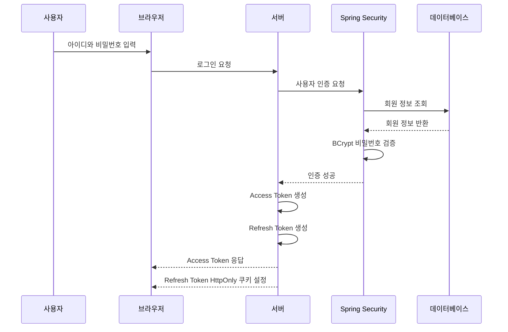
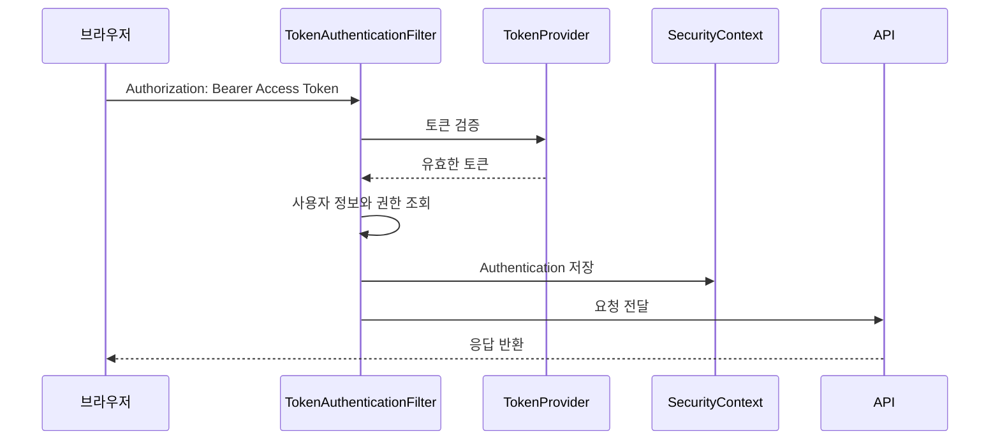
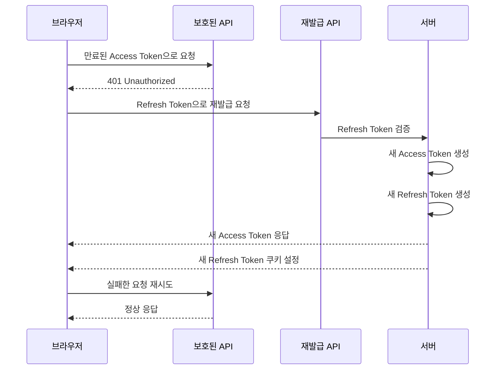
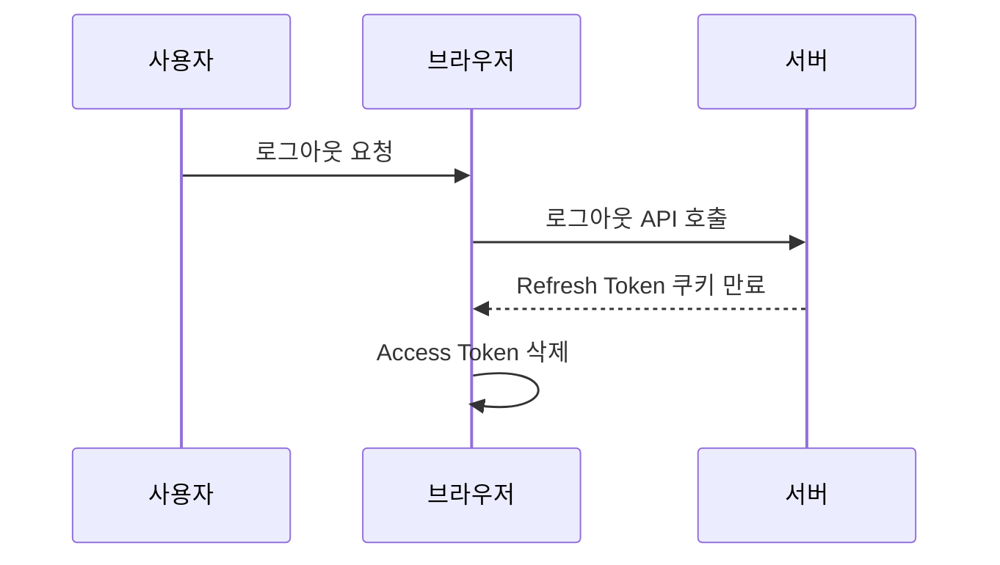
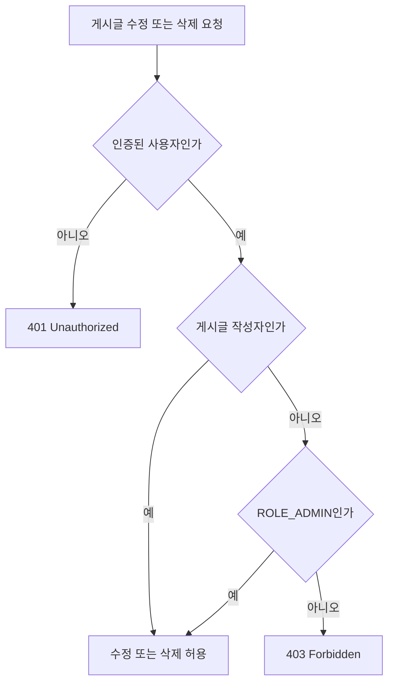

# JPA 게시판 Spring Security 적용

기존 JPA 게시판에 Spring Security와 JWT 기반 인증·인가를 적용한 과제다.

Access Token과 Refresh Token을 분리하여 인증을 처리하고, 게시글 수정·삭제 시 작성자와 관리자 권한을 검증하도록 구현했다.

## 주요 기능

### 회원

- 회원가입
- BCrypt 기반 비밀번호 암호화
- 로그인 및 로그아웃
- 로그인 회원 정보 조회

### 게시글

- 게시글 목록 및 상세 조회
- 게시글 작성·수정·삭제
- 파일 첨부 및 다운로드
- 페이지네이션

### 인증·인가

- JWT Access Token과 Refresh Token 발급
- Bearer Token 기반 API 인증
- Access Token 만료 시 자동 재발급
- 작성자와 관리자 기반 게시글 수정·삭제 인가
- 인증 실패 시 `401 Unauthorized`
- 권한 부족 시 `403 Forbidden`

## 기술 스택

- Java 17
- Spring Boot
- Spring Security
- Spring Data JPA
- MySQL
- JJWT
- Thymeleaf
- JavaScript
- Gradle

## Security 구성

서버 세션을 사용하지 않는 Stateless 방식으로 구성했다.

Spring Security의 기본 Form Login, HTTP Basic, Logout은 비활성화하고 직접 구현한 로그인 API와 JWT 인증 필터를 사용한다.

| 토큰 | 저장 위치 | 용도 |
| --- | --- | --- |
| Access Token | 브라우저 `localStorage` | API 요청 인증 |
| Refresh Token | `HttpOnly` 쿠키 | Access Token 재발급 |

Access Token은 API 요청의 `Authorization` 헤더에 포함한다.

```http
Authorization: Bearer {accessToken}
```

Refresh Token은 JavaScript에서 직접 읽을 수 없는 `HttpOnly` 쿠키에 저장한다.

## Security Flow

### 1. 로그인



1. 사용자가 아이디와 비밀번호를 입력한다.
2. `AuthenticationManager`가 회원 정보를 조회하고 비밀번호를 검증한다.
3. 인증에 성공하면 Access Token과 Refresh Token을 생성한다.
4. Access Token은 응답 body로 반환한다.
5. Refresh Token은 `HttpOnly` 쿠키에 저장한다.
6. 브라우저는 Access Token을 `localStorage`에 저장한다.

### 2. 인증이 필요한 API 요청



1. 브라우저가 Access Token을 Bearer Token 형식으로 전송한다.
2. `TokenAuthenticationFilter`가 토큰을 추출한다.
3. `TokenProvider`가 서명, 발급자, 만료 여부를 검증한다.
4. 토큰 타입이 `ACCESS`인지 확인한다.
5. 사용자 정보를 조회해 인증 객체를 생성한다.
6. 인증 객체를 `SecurityContextHolder`에 저장한다.
7. 인증된 상태로 API 요청을 처리한다.

Refresh Token은 일반 API 인증에 사용하지 않는다.

### 3. Access Token 재발급



1. Access Token이 없거나 만료되면 서버가 `401 Unauthorized`를 반환한다.
2. 브라우저는 `/api/tokens/refresh`에 재발급을 요청한다.
3. Refresh Token 쿠키가 요청에 자동으로 포함된다.
4. 서버는 Refresh Token의 서명, 만료 여부와 `REFRESH` 타입을 확인한다.
5. 검증에 성공하면 새로운 Access Token과 Refresh Token을 생성한다.
6. 브라우저는 Access Token을 교체하고 실패했던 요청을 한 번 재시도한다.

재발급 시 새로운 Refresh Token을 생성해 기존 쿠키에 덮어쓴다.

### 4. 로그아웃



1. 서버는 Refresh Token 쿠키의 `Max-Age`를 `0`으로 설정한다.
2. 브라우저는 `localStorage`의 Access Token을 삭제한다.
3. 이후 새로운 Access Token을 재발급받을 수 없다.

JWT는 Stateless 방식이므로 이미 발급된 Access Token은 자체 만료 시점까지 유효할 수 있다.

## 인가 Flow

인가 검사는 게시글 수정과 삭제 메서드에 적용했다.

```text
BoardService.updateArticle()
BoardService.deleteArticle()
```



Controller는 `@AuthenticationPrincipal`을 통해 현재 인증된 사용자의 아이디와 역할을 가져온다.

Service는 현재 사용자가 게시글 작성자이거나 `ROLE_ADMIN`인지 확인한다. 두 조건을 모두 만족하지 않으면 `AccessDeniedException`을 발생시킨다.

클라이언트가 전달한 사용자 정보가 아니라 Spring Security의 인증 객체를 기준으로 권한을 검증한다.

### 권한 정책

| 기능 | 비회원 | 일반 회원 | 작성자 | 관리자 |
| --- | --- | --- | --- | --- |
| 게시글 목록 조회 | 가능 | 가능 | 가능 | 가능 |
| 게시글 상세 조회 | 가능 | 가능 | 가능 | 가능 |
| 게시글 작성 | 불가 | 가능 | 가능 | 가능 |
| 게시글 수정 | 불가 | 불가 | 가능 | 가능 |
| 게시글 삭제 | 불가 | 불가 | 가능 | 가능 |

`ROLE_ADMIN`은 Role Hierarchy를 통해 `ROLE_USER` 권한을 포함한다.

## 주요 API

### 회원과 인증

| Method | URL | 설명 | 인증 |
| --- | --- | --- | --- |
| POST | `/api/members/join` | 회원가입 | 불필요 |
| POST | `/api/members/login` | 로그인 및 토큰 발급 | 불필요 |
| GET | `/api/members/info` | 로그인 회원 정보 조회 | 필요 |
| POST | `/api/members/logout` | 로그아웃 | 불필요 |
| POST | `/api/tokens/refresh` | 토큰 재발급 | Refresh Token 필요 |

### 게시글

| Method | URL | 설명 | 인증 및 권한 |
| --- | --- | --- | --- |
| GET | `/api/boards` | 게시글 목록 조회 | 불필요 |
| GET | `/api/boards/{id}` | 게시글 상세 조회 | 불필요 |
| POST | `/api/boards` | 게시글 작성 | 인증 필요 |
| PUT | `/api/boards/{id}` | 게시글 수정 | 작성자 또는 관리자 |
| DELETE | `/api/boards/{id}` | 게시글 삭제 | 작성자 또는 관리자 |

## 환경 설정

프로젝트 루트에 `.env` 파일을 생성한다.

```properties
DB_USERNAME=MySQL 사용자명
DB_PASSWORD=MySQL 비밀번호
JWT_SECRET_KEY=Base64로 인코딩한 JWT 비밀키
```

`.env` 파일에는 민감한 정보가 포함되므로 Git에 커밋하지 않는다.

## 실행 방법

프로젝트 경로로 이동한다.

```powershell
cd assignments/springboot/jpa-board
```

애플리케이션을 실행한다.

```powershell
.\gradlew.bat bootRun
```

테스트를 실행한다.

```powershell
.\gradlew.bat clean test
```

전체 빌드를 실행한다.

```powershell
.\gradlew.bat build
```

실행 후 다음 주소로 접속한다.

```text
http://localhost:8080
```

## 테스트 범위

- 회원가입 성공 및 중복 아이디 예외
- 회원가입 시 비밀번호 인코딩과 회원 저장
- 로그인 시 Access Token과 Refresh Token 발급
- Refresh Token 기반 토큰 재발급
- 유효하지 않은 토큰 거부
- Access Token과 Refresh Token 타입 검증
- JWT 만료 및 변조 검증
- 작성자의 게시글 수정·삭제
- 다른 일반 회원의 게시글 수정·삭제 거부
- 관리자의 게시글 수정·삭제
- Spring ApplicationContext 정상 로딩