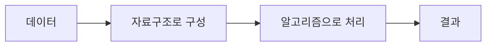
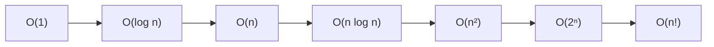

# 자료구조와 알고리즘

## 자료구조와 알고리즘

자료구조는 데이터를 저장하고 구성하는 방식이며, 알고리즘은 구성된 데이터를 처리해 원하는 결과를 만드는 절차다.

같은 문제라도 어떤 자료구조와 알고리즘을 선택하는지에 따라 실행 시간과 메모리 사용량이 달라진다.



## 자료구조

자료구조는 데이터의 배치 형태에 따라 선형 자료구조와 비선형 자료구조로 구분할 수 있다.

| 구분       | 특징                    | 예시                     |
| -------- | --------------------- | ---------------------- |
| 선형 자료구조  | 데이터가 순서대로 연결된다        | 배열, List, Stack, Queue |
| 비선형 자료구조 | 데이터가 계층 또는 연결 관계를 가진다 | Tree, Graph            |

자료구조에서는 일반적으로 다음과 같은 CRUD 작업을 수행한다.

| 작업     | 의미     |
| ------ | ------ |
| Create | 데이터 추가 |
| Read   | 데이터 조회 |
| Update | 데이터 변경 |
| Delete | 데이터 삭제 |

## 알고리즘

알고리즘은 데이터를 처리하는 구체적인 방법이다. 같은 작업도 여러 방식으로 구현할 수 있으므로 데이터의 특성과 성능 요구사항을 고려해 선택해야 한다.

대표적인 알고리즘은 다음과 같다.

* 정렬: 데이터를 일정한 순서로 배치한다
* 탐색: 원하는 데이터를 찾는다
* 삽입과 삭제: 데이터를 추가하거나 제거한다
* 경로 탐색: 연결된 데이터 사이의 이동 경로를 찾는다

정렬 알고리즘에는 Bubble Sort, Insertion Sort, Merge Sort, Quick Sort 등이 있다.

## Mutable과 Immutable

Mutable 객체는 생성된 이후 내부 상태를 변경할 수 있고, Immutable 객체는 생성 이후 내부 상태를 변경할 수 없다.

* Mutable: `ArrayList`, `StringBuilder`
* Immutable: `String`, `Integer`

`final` 참조 변수는 다른 객체를 다시 참조할 수 없지만, 참조 중인 객체의 내부 상태까지 변경할 수 없는 것은 아니다.

```java
final List<String> names = new ArrayList<>();

names.add("Kim");              // 가능
// names = new ArrayList<>();  // 불가능
```

따라서 `final` 참조와 immutable 객체는 구분해야 한다.

## String과 Wrapper 클래스 비교

`String`은 immutable 객체이므로 문자열을 변경하면 기존 객체가 수정되는 것이 아니라 새로운 객체가 생성된다.

객체의 값을 비교할 때는 `==`가 아니라 `equals()`를 사용해야 한다.

```java
String str1 = new String("Hello");
String str2 = new String("Hello");

System.out.println(str1 == str2);      // false
System.out.println(str1.equals(str2)); // true
```

`Integer`와 같은 Wrapper 클래스도 일부 값을 캐싱해 재사용할 수 있으므로, `==`의 결과에 의존하지 않고 `equals()`로 비교해야 한다.

## 알고리즘 성능 평가

알고리즘은 다음 기준으로 평가할 수 있다.

| 기준    | 설명                       |
| ----- | ------------------------ |
| 정확성   | 올바른 결과를 반환하는가            |
| 시간복잡도 | 입력 증가에 따라 연산량이 얼마나 증가하는가 |
| 공간복잡도 | 추가 메모리를 얼마나 사용하는가        |
| 단순성   | 구현과 이해가 간단한가             |
| 최적성   | 더 개선할 여지가 적은가            |

## 시간복잡도

시간복잡도는 입력 크기가 증가할 때 연산량이 증가하는 정도를 나타내며, 일반적으로 Big O 표기법을 사용한다.

| 표기           | 명칭       | 예시         |
| ------------ | -------- | ---------- |
| `O(1)`       | 상수 시간    | 배열 인덱스 접근  |
| `O(log n)`   | 로그 시간    | 이진 탐색      |
| `O(n)`       | 선형 시간    | 전체 데이터 순회  |
| `O(n log n)` | 선형 로그 시간 | Merge Sort |
| `O(n²)`      | 이차 시간    | 이중 반복문     |
| `O(2ⁿ)`      | 지수 시간    | 부분집합 완전 탐색 |
| `O(n!)`      | 팩토리얼 시간  | 모든 순열 탐색   |



오른쪽으로 갈수록 입력 크기가 증가했을 때 연산량이 더 빠르게 증가한다.

## 기억할 판단 기준

* 자료구조는 데이터를 구성하는 방식이다.
* 알고리즘은 데이터를 처리하는 절차다.
* 자료구조와 알고리즘의 선택에 따라 성능이 달라진다.
* `final` 참조 변수가 가리키는 객체가 반드시 immutable인 것은 아니다.
* 객체의 값은 `equals()`로 비교한다.
* 시간복잡도는 실제 실행 시간이 아니라 입력 증가에 따른 연산량의 증가 추세를 나타낸다.
